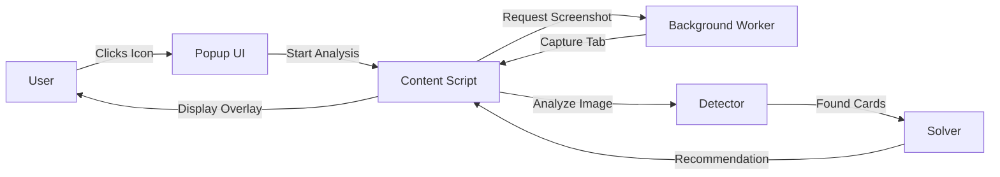
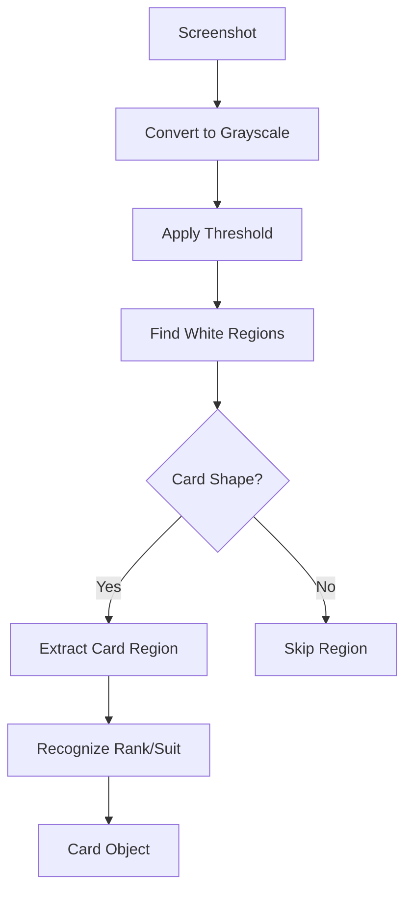
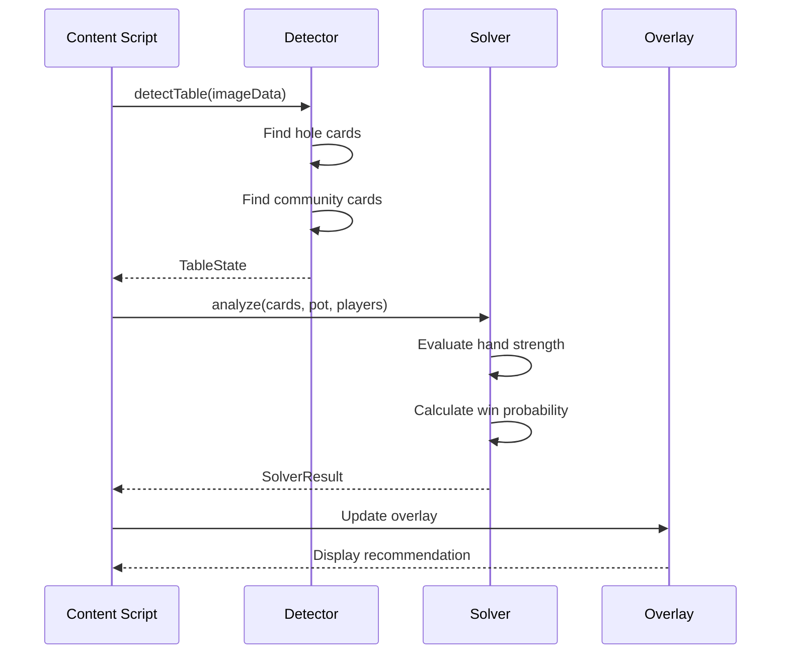
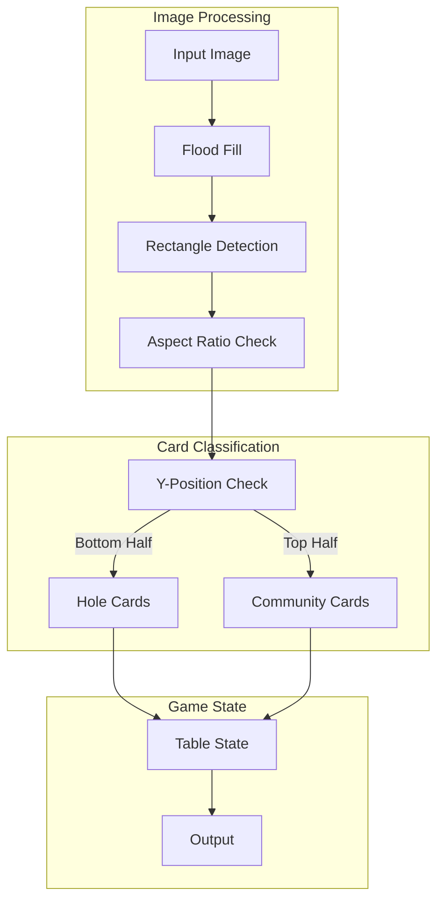
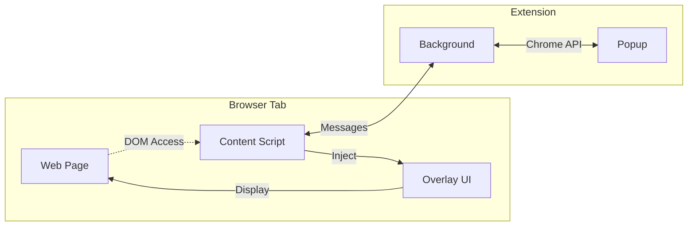

# Poker Tab Analyzer

A Chrome extension that provides real-time poker hand analysis using computer vision and the pokersolver library.

## Features

- **Generic Computer Vision**: Works with any poker site - no configuration needed
- **Real-time Analysis**: Analyzes hands every 250ms (configurable)
- **Poker Solver Integration**: Uses pokersolver.js for hand evaluation
- **Privacy First**: All processing happens locally in your browser
- **Comprehensive Tests**: Full test coverage for reliability

## Installation

### From Source

```bash
# Clone the repository
git clone https://github.com/pselamy/poker-tab-analyzer.git
cd poker-tab-analyzer

# Install dependencies
pnpm install

# Run tests
./test.sh

# Build extension
./build.sh
```

### Load in Chrome

1. Open Chrome and go to `chrome://extensions/`
2. Enable "Developer mode"
3. Click "Load unpacked"
4. Select the `dist/extension` directory

## Usage

1. Navigate to any poker site
2. Click the extension icon
3. Click "Start Analysis"
4. Play poker - the extension will detect cards and provide recommendations

## Development

### Project Structure

```
poker-tab-analyzer/
├── MODULE.bazel          # Bazel module configuration
├── extension/            # Chrome extension source
│   ├── content.ts       # Content script
│   ├── background.ts    # Service worker
│   └── popup.ts         # Extension UI
├── lib/                 # Core libraries
│   ├── detector.ts      # Computer vision card detection
│   ├── solver.ts        # Poker solver wrapper
│   └── vision.ts        # Image processing utilities
└── tests/               # Test files
```

### Running Tests

```bash
# Run all tests
./test.sh

# Run tests with Node.js directly
node --test dist/**/*_test.js

# Type check
pnpm tsc --noEmit
```

### Building

```bash
# Build extension
./build.sh

# Output will be in:
# - dist/extension/ (unpacked extension)
# - dist/poker-tab-analyzer.zip (packaged extension)
```

## How It Works

### Extension Architecture



### Card Detection Process



### Hand Analysis Flow



### Computer Vision Pipeline



### Extension Communication



## Contributing

1. Fork the repository
2. Create a feature branch
3. Write tests for your changes
4. Ensure `bazel test //...` passes
5. Submit a pull request

## License

MIT License - see LICENSE file for details
